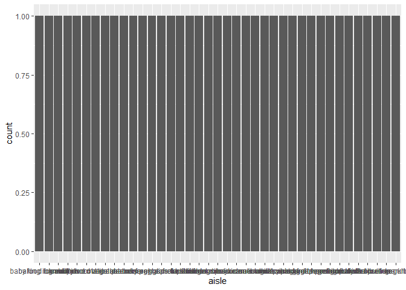

P8105 Homework 3
================
Rachel Heise
10/4/2020

## Problem 1

This data has 1384617 observations and 15 columns. The data is organized
where each row is an item from one order, and the data set contains info
on the item name and department and aisle where it can be found. It also
contains information on whether that item was reordered, and information
on that order (order number and time of order).

``` r
num_aisles = nrow(
  instacart %>% 
  group_by(aisle) %>% 
  summarize(count = n())
)
```

    ## `summarise()` ungrouping output (override with `.groups` argument)

``` r
instacart %>% 
  group_by(aisle) %>%
  summarize(n_obs = n()) %>% 
  filter(n_obs > 10000) %>% 
  ggplot(aes(x = aisle)) +
  geom_bar()
```

    ## `summarise()` ungrouping output (override with `.groups` argument)

<!-- -->

## Problem 2

``` r
accel_df = 
  read_csv("./data/accel_data.csv") %>% 
  janitor::clean_names() %>% 
  pivot_longer(
    activity_1:activity_1440,
    names_to = "activity_period",
    values_to = "activity_count"
    ) %>% 
  mutate(weekday_weekend = recode(day, "Monday" = "weekday","Tuesday" = "weekday", "Wednesday" = "weekday", "Thursday" = "weekday", "Friday" = "weekday", "Saturday" = "weekend", "Sunday" = "weekend"))
```

    ## Parsed with column specification:
    ## cols(
    ##   .default = col_double(),
    ##   day = col_character()
    ## )

    ## See spec(...) for full column specifications.
