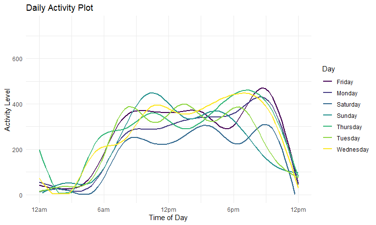

P8105 Homework 3
================
Rachel Heise
10/4/2020

## Problem 1

``` r
data("instacart")
head(instacart)
```

    ## # A tibble: 6 x 15
    ##   order_id product_id add_to_cart_ord~ reordered user_id eval_set order_number
    ##      <int>      <int>            <int>     <int>   <int> <chr>           <int>
    ## 1        1      49302                1         1  112108 train               4
    ## 2        1      11109                2         1  112108 train               4
    ## 3        1      10246                3         0  112108 train               4
    ## 4        1      49683                4         0  112108 train               4
    ## 5        1      43633                5         1  112108 train               4
    ## 6        1      13176                6         0  112108 train               4
    ## # ... with 8 more variables: order_dow <int>, order_hour_of_day <int>,
    ## #   days_since_prior_order <int>, product_name <chr>, aisle_id <int>,
    ## #   department_id <int>, aisle <chr>, department <chr>

This data has 1384617 observations and 15 columns. The data is organized
where each row is an item from one order, and the data set contains info
on the item name and department and aisle where it can be found. It also
contains information on whether that item was reordered, and information
on that order (order number and time of order).

User/order variables – user ID, order ID, order day, order hour. Item
variables – name, aisle, department, and some numeric codes.

Aisles are contained in departments

Analyze number of aisles and which has the most items ordered from

``` r
instacart %>% 
  count(aisle) %>% 
  arrange(desc(n))
```

    ## # A tibble: 134 x 2
    ##    aisle                              n
    ##    <chr>                          <int>
    ##  1 fresh vegetables              150609
    ##  2 fresh fruits                  150473
    ##  3 packaged vegetables fruits     78493
    ##  4 yogurt                         55240
    ##  5 packaged cheese                41699
    ##  6 water seltzer sparkling water  36617
    ##  7 milk                           32644
    ##  8 chips pretzels                 31269
    ##  9 soy lactosefree                26240
    ## 10 bread                          23635
    ## # ... with 124 more rows

There are 134 aisles, and the most ordered items are from fresh
vegetables, fresh fruits, and packaged vegetables fruits.

Plot items ordered in each aisle, but only those with greater than
10,000 items ordered

``` r
instacart %>% 
  count(aisle) %>% 
  filter(n > 10000) %>% 
  mutate(
    aisle = factor(aisle),
    aisle = fct_reorder(aisle, n)
  ) %>% 
  ggplot(aes(x = aisle, y = n)) +
  geom_point() +
  theme(axis.text.x = element_text(angle = 90, vjust = 0.5, hjust = 1))
```


Make a table of most popular items in three aisles:

``` r
instacart %>% 
  filter(aisle %in% c("baking ingredients", "dog food care", "packaged vegetables fruits")) %>%
  group_by(aisle) %>% 
  count(product_name) %>% 
  mutate(rank = min_rank(desc(n))) %>% 
  filter(rank < 4) %>% 
  arrange(aisle, rank) %>% 
  knitr::kable()
```

| aisle                      | product\_name                                 |    n | rank |
| :------------------------- | :-------------------------------------------- | ---: | ---: |
| baking ingredients         | Light Brown Sugar                             |  499 |    1 |
| baking ingredients         | Pure Baking Soda                              |  387 |    2 |
| baking ingredients         | Cane Sugar                                    |  336 |    3 |
| dog food care              | Snack Sticks Chicken & Rice Recipe Dog Treats |   30 |    1 |
| dog food care              | Organix Chicken & Brown Rice Recipe           |   28 |    2 |
| dog food care              | Small Dog Biscuits                            |   26 |    3 |
| packaged vegetables fruits | Organic Baby Spinach                          | 9784 |    1 |
| packaged vegetables fruits | Organic Raspberries                           | 5546 |    2 |
| packaged vegetables fruits | Organic Blueberries                           | 4966 |    3 |

Mean time of day for Apples and Ice cream

``` r
instacart %>% 
  filter(product_name %in% c("Pink Lady Apples", "Coffee Ice Cream")) %>% 
  group_by(product_name, order_dow) %>% 
  summarize(mean_hour = mean(order_hour_of_day)) %>% 
  pivot_wider(
    names_from = order_dow,
    values_from = mean_hour
  ) %>% 
    knitr::kable()
```

    ## `summarise()` regrouping output by 'product_name' (override with `.groups` argument)

| product\_name    |        0 |        1 |        2 |        3 |        4 |        5 |        6 |
| :--------------- | -------: | -------: | -------: | -------: | -------: | -------: | -------: |
| Coffee Ice Cream | 13.77419 | 14.31579 | 15.38095 | 15.31818 | 15.21739 | 12.26316 | 13.83333 |
| Pink Lady Apples | 13.44118 | 11.36000 | 11.70213 | 14.25000 | 11.55172 | 12.78431 | 11.93750 |

## Problem 2

``` r
accel_df = 
  read_csv("./data/accel_data.csv") %>% 
  janitor::clean_names() %>% 
  pivot_longer(
    activity_1:activity_1440,
    names_to = "activity_minute",
    values_to = "activity_count"
    ) %>% 
  mutate(activity_minute = substr(activity_minute, 10, 12)) %>% 
  mutate(weekday_weekend = recode(day, "Monday" = "weekday", "Tuesday" = "weekday", "Wednesday" = "weekday", "Thursday" = "weekday", "Friday" = "weekday", "Saturday" = "weekend", "Sunday" = "weekend"))
```

    ## Parsed with column specification:
    ## cols(
    ##   .default = col_double(),
    ##   day = col_character()
    ## )

    ## See spec(...) for full column specifications.

There are 6 variables in this data set, and 50400 observations. Data of
interest includes the activity period and activity count, which are
respectively the minute of the day the measurement was taken, and the
amount of activity that the man did during that minute. The week and day
of the five week sample are included, as well as what day of the week
each measurement was taken during. This is additionally broken into
weekday and weekend categories.

\-Recode variables (factor, etc) make sure minute of the day is numeric
-Order variables reasonably

might have to use factors to order day of the week properly Total
activity variable for each day Aggregate using sum

``` r
accel_df %>% 
  group_by(day_id) %>% 
  summarize(daily_activity = sum(activity_count)) %>% 
  knitr::kable()
```

    ## `summarise()` ungrouping output (override with `.groups` argument)

| day\_id | daily\_activity |
| ------: | --------------: |
|       1 |       480542.62 |
|       2 |        78828.07 |
|       3 |       376254.00 |
|       4 |       631105.00 |
|       5 |       355923.64 |
|       6 |       307094.24 |
|       7 |       340115.01 |
|       8 |       568839.00 |
|       9 |       295431.00 |
|      10 |       607175.00 |
|      11 |       422018.00 |
|      12 |       474048.00 |
|      13 |       423245.00 |
|      14 |       440962.00 |
|      15 |       467420.00 |
|      16 |       685910.00 |
|      17 |       382928.00 |
|      18 |       467052.00 |
|      19 |       371230.00 |
|      20 |       381507.00 |
|      21 |       468869.00 |
|      22 |       154049.00 |
|      23 |       409450.00 |
|      24 |         1440.00 |
|      25 |       260617.00 |
|      26 |       340291.00 |
|      27 |       319568.00 |
|      28 |       434460.00 |
|      29 |       620860.00 |
|      30 |       389080.00 |
|      31 |         1440.00 |
|      32 |       138421.00 |
|      33 |       549658.00 |
|      34 |       367824.00 |
|      35 |       445366.00 |

Single panel plot Show activity - minute on x, activity count on y
Geom\_line maybe Color of day of week (aes mapping)

``` r
accel_df %>% 
  ggplot(aes(x = activity_minute, y = activity_count, color = day)) +
  geom_line()
```



## Problem 3

``` r
data("ny_noaa")
```

convert tenths of a degree C to degrees C snowfall commonly observed -
count\! 2 panel plot: data manipulation steps, then plotting step.
group\_by(station, year, month) and summarize(average max temp), filter
for jan and july. Separate line for each station. Use faceting for two
panel plot.

Comment on global warming, are some stations always colder?

Next 2 panel plot: pair two fundamentally dif plots together
(patchwork).

Tmax vs tmin (contour plot, bin plot, or hex plot)

distr of snowfall values: boxplots, violin plots, ridge plots
