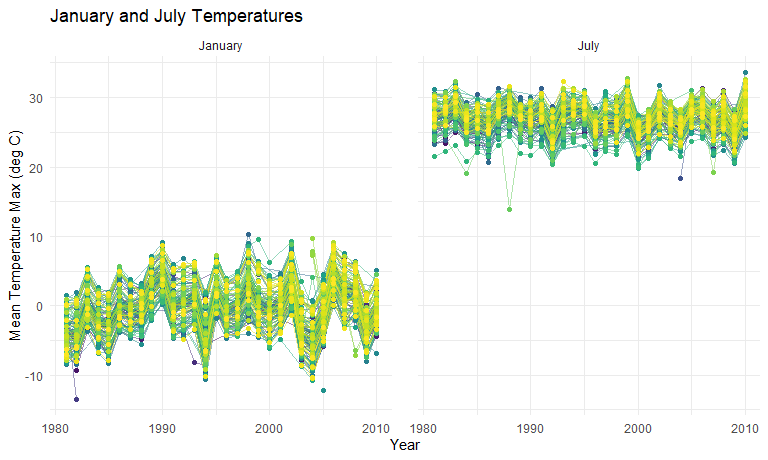

P8105 Homework 3
================
Rachel Heise
10/4/2020

## Problem 1

``` r
data("instacart")
head(instacart)
```

This data has 1384617 observations and 15 columns. The data contains
both user/order variables and item variables. Variables relating to the
user and order are the user ID, order ID, order day, order hour, and
days since prior order. Item variables include product ID, reordered
(whether or not the user had ordered this previously), product name,
aisle, and department. There are multiple aisles contained within
departments.

Analyze number of aisles and which has the most items ordered from.

``` r
instacart %>% 
  count(aisle) %>% 
  arrange(desc(n))
```

    ## # A tibble: 134 x 2
    ##    aisle                              n
    ##    <chr>                          <int>
    ##  1 fresh vegetables              150609
    ##  2 fresh fruits                  150473
    ##  3 packaged vegetables fruits     78493
    ##  4 yogurt                         55240
    ##  5 packaged cheese                41699
    ##  6 water seltzer sparkling water  36617
    ##  7 milk                           32644
    ##  8 chips pretzels                 31269
    ##  9 soy lactosefree                26240
    ## 10 bread                          23635
    ## # ... with 124 more rows

There are 134 aisles, and the most ordered items are from fresh
vegetables, fresh fruits, and packaged vegetables fruits.

Plot items ordered in each aisle, but only those with greater than
10,000 items ordered.

``` r
instacart %>% 
  count(aisle) %>% 
  filter(n > 10000) %>% 
  mutate(
    aisle = factor(aisle),
    aisle = fct_reorder(aisle, n)
  ) %>% 
  ggplot(aes(x = aisle, y = n)) +
  geom_point() +
  theme(axis.text.x = element_text(angle = 90, vjust = 0.5, hjust = 1)) +
  labs(
    title = "Items Ordered per Aisle",
    x = "Aisle",
    y = "Number of Items"
    )
```


Make a table of the most popular items in three aisles.

``` r
instacart %>% 
  filter(aisle %in% c("baking ingredients", "dog food care", "packaged vegetables fruits")) %>%
  group_by(aisle) %>% 
  count(product_name) %>% 
  mutate(rank = min_rank(desc(n))) %>% 
  filter(rank < 4) %>% 
  arrange(aisle, rank) %>% 
  knitr::kable()
```

| aisle                      | product\_name                                 |    n | rank |
| :------------------------- | :-------------------------------------------- | ---: | ---: |
| baking ingredients         | Light Brown Sugar                             |  499 |    1 |
| baking ingredients         | Pure Baking Soda                              |  387 |    2 |
| baking ingredients         | Cane Sugar                                    |  336 |    3 |
| dog food care              | Snack Sticks Chicken & Rice Recipe Dog Treats |   30 |    1 |
| dog food care              | Organix Chicken & Brown Rice Recipe           |   28 |    2 |
| dog food care              | Small Dog Biscuits                            |   26 |    3 |
| packaged vegetables fruits | Organic Baby Spinach                          | 9784 |    1 |
| packaged vegetables fruits | Organic Raspberries                           | 5546 |    2 |
| packaged vegetables fruits | Organic Blueberries                           | 4966 |    3 |

Table of mean time of day that Pink Lady Apples and Coffee Ice Cream are
ordered.

``` r
instacart %>% 
  filter(product_name %in% c("Pink Lady Apples", "Coffee Ice Cream")) %>% 
  group_by(product_name, order_dow) %>% 
  summarize(mean_hour = mean(order_hour_of_day)) %>% 
  pivot_wider(
    names_from = order_dow,
    values_from = mean_hour
  ) %>% 
    knitr::kable()
```

    ## `summarise()` regrouping output by 'product_name' (override with `.groups` argument)

| product\_name    |        0 |        1 |        2 |        3 |        4 |        5 |        6 |
| :--------------- | -------: | -------: | -------: | -------: | -------: | -------: | -------: |
| Coffee Ice Cream | 13.77419 | 14.31579 | 15.38095 | 15.31818 | 15.21739 | 12.26316 | 13.83333 |
| Pink Lady Apples | 13.44118 | 11.36000 | 11.70213 | 14.25000 | 11.55172 | 12.78431 | 11.93750 |

## Problem 2

Import and clean accelerometer data.

``` r
accel_df = 
  read_csv("./data/accel_data.csv") %>% 
  janitor::clean_names() %>% 
  pivot_longer(
    activity_1:activity_1440,
    names_to = "activity_minute",
    values_to = "activity_count"
    ) %>% 
  mutate(activity_minute = substr(activity_minute, 10, 13)) %>% 
  mutate(activity_minute = as.numeric(activity_minute)) %>% 
  mutate(weekday_weekend = recode(day, "Monday" = "weekday", "Tuesday" = "weekday", "Wednesday" = "weekday", "Thursday" = "weekday", "Friday" = "weekday", "Saturday" = "weekend", "Sunday" = "weekend"))
```

    ## Parsed with column specification:
    ## cols(
    ##   .default = col_double(),
    ##   day = col_character()
    ## )

    ## See spec(...) for full column specifications.

There are 6 variables in this data set, and 50400 observations. Data of
interest includes the activity period and activity count, which are
respectively the minute of the day the measurement was taken and the
amount of activity that the man did during that minute. The week and day
of the five week sample are included, as well as what day of the week
each measurement was taken during. This is additionally broken into
weekday and weekend categories.

``` r
accel_df %>% 
  group_by(day_id) %>% 
  summarize(daily_activity = sum(activity_count)) %>% 
  knitr::kable()
```

    ## `summarise()` ungrouping output (override with `.groups` argument)

| day\_id | daily\_activity |
| ------: | --------------: |
|       1 |       480542.62 |
|       2 |        78828.07 |
|       3 |       376254.00 |
|       4 |       631105.00 |
|       5 |       355923.64 |
|       6 |       307094.24 |
|       7 |       340115.01 |
|       8 |       568839.00 |
|       9 |       295431.00 |
|      10 |       607175.00 |
|      11 |       422018.00 |
|      12 |       474048.00 |
|      13 |       423245.00 |
|      14 |       440962.00 |
|      15 |       467420.00 |
|      16 |       685910.00 |
|      17 |       382928.00 |
|      18 |       467052.00 |
|      19 |       371230.00 |
|      20 |       381507.00 |
|      21 |       468869.00 |
|      22 |       154049.00 |
|      23 |       409450.00 |
|      24 |         1440.00 |
|      25 |       260617.00 |
|      26 |       340291.00 |
|      27 |       319568.00 |
|      28 |       434460.00 |
|      29 |       620860.00 |
|      30 |       389080.00 |
|      31 |         1440.00 |
|      32 |       138421.00 |
|      33 |       549658.00 |
|      34 |       367824.00 |
|      35 |       445366.00 |

From the above table, it appears there were two days where this man did
not wear the accelerometer because the activity count is at the baseline
(day 24 and day 31). It does not appear that his activity levels are
trending over time, but there are a few days in these five weeks where
he had quite high activity levels, greater than 600,000 per day, and
some low days, under 100,000 per day.

Create a single-panel plot showing 24 hour activity levels.

``` r
accel_df %>%
  group_by(day, activity_minute) %>% 
  summarize(mean_activities = mean(activity_count)) %>% 
  ggplot(aes(x = activity_minute, y = mean_activities, color = day)) + 
  scale_x_continuous(
    breaks = c(1, 360, 720, 1080, 1440),
    labels = c("12am", "6am", "12pm", "6pm", "12pm")
  ) +
  scale_y_continuous(limit = c(0, 750)
  ) +
  geom_smooth(se = FALSE) +
  viridis::scale_color_viridis(
    name = "Day",
    discrete = TRUE) +
  labs(
    title = "Daily Activity Plot",
    x = "Time of Day",
    y = "Activity Level"
  )
```

    ## `summarise()` regrouping output by 'day' (override with `.groups` argument)

    ## `geom_smooth()` using method = 'gam' and formula 'y ~ s(x, bs = "cs")'


From the above plot, we can see that starting at around midnight every
day, on average the individual was moving hardly at all which is to be
expected because he is likely asleep. Some noteworthy spikes on the plot
are on Sundays, where activity was quite high between 9 am and noon, and
on Fridays, activity was high between 8 pm and 10 pm. On average, the
lowest activity day of the week was Saturday. In general, all days have
steadily increasing activity from 6 am to 10 am, at which point activity
stabilizes before reducing around 9 pm.

## Problem 3

``` r
data("ny_noaa")

ny_df = ny_noaa %>% 
  mutate(
    tmin = as.numeric(tmin), tmax = as.numeric(tmax)) %>% 
  mutate(
    tmin = tmin / 10,
    tmax = tmax / 10)
```

This data set contains data, for each day and New York state weather
station, on daily precipitation, max and min temperatures, and snow
depth. There are 2595176 observations and 7 variables. Tmin and tmax are
the minimum and maximum daily temperatures, respectively, in degrees C.
ID provides the weather station ID for each station. Precipitation data
is given in tenths of a mm, as well as daily snowfall (mm) and snow
depth (mm). Missing data is a major concern with this data set; many of
the rows of data only contain information on one of the precipitation
and temperature variables.

Perform further data cleaning:

``` r
ny_df = ny_df %>% 
  separate(date, into = c("year", "month", "day"), sep = "[-]", convert = TRUE) %>% 
  mutate(snow = as.double(snow))


ny_df %>% 
  count(snow) %>% 
  arrange(desc(n))
```

    ## # A tibble: 282 x 2
    ##     snow       n
    ##    <dbl>   <int>
    ##  1     0 2008508
    ##  2    NA  381221
    ##  3    25   31022
    ##  4    13   23095
    ##  5    51   18274
    ##  6    76   10173
    ##  7     8    9962
    ##  8     5    9748
    ##  9    38    9197
    ## 10     3    8790
    ## # ... with 272 more rows

The most commonly observed amounts of snowfall are 0 and NA. 0 is quite
likely because during the summer and warmer parts of the spring and fall
in NY state, there will mostly be no snow.

Create a two-panel plot of average max temperature for January and July.

``` r
month_names = c(`1` = "January", `7` = "July")


ny_df %>% 
  group_by(id, month, year) %>% 
  filter(month %in% c(1,7)) %>% 
  summarize(mean_tmax = mean(tmax, na.rm = TRUE)) %>%
  na.omit() %>% 
  ggplot(aes(x = year, y = mean_tmax, color = id)) +
  geom_line(alpha = 0.5) +
  geom_point() +
  facet_grid(. ~ month, labeller = as_labeller(month_names)) +
  theme(legend.position = "none", panel.spacing.x = unit(20, "pt")) +
  labs(
    title = "January and July Temperatures",
    x = "Year",
    y = "Mean Tmax"
  ) +
  viridis::scale_color_viridis(
    discrete = TRUE) +
  scale_x_continuous(
    breaks = c(1980, 1990, 2000, 2010),
    labels = c("1980", "1990", "2000", "2010")
  )
```

    ## `summarise()` regrouping output by 'id', 'month' (override with `.groups` argument)



The above plot shows the mean temperatures at each station for the
months of January and July, from 1980 to 2010. As expected, July
temperatures are much warmer than January temperatures for all stations
in New York. The January temperatures seem to have warmed over time, and
there is also greater spread of temperatures in the 2000s than in the
1980s and 1990s. July temperatures look more stable over time. There are
outliers on both plots, and one point in January of 1982 particularly
stands out, as well as a point in July of 1988. Although there is
variation between stations in each year, across years they tend to
follow similar patterns: when one station has a warm month, most other
stations also have a warm month.

Create two-panel plot of min vs. max temperatures and snowfall
distributions.

``` r
tmax_tmin = ny_df %>% 
  ggplot(aes(x = tmax, y = tmin)) +
  geom_hex() +
  labs(
    title = "Max and Min Temperatures",
    x = "Tmax",
    y = "Tmin"
  ) +
  viridis::scale_color_viridis(
    discrete = TRUE) +
  knitr::opts_chunk$set(fig.width = 15, fig.height = 12)


  
snowfall = ny_df %>% 
  filter(snow > 0, snow < 100) %>% 
  mutate(year = as.factor(year)) %>% 
  ggplot(aes(x = snow, y = year)) +
  geom_boxplot(alpha = 0.5) +
  labs(
    title = "Snowfall Distribution",
    x = "Year",
    y = "Snowfall"
  ) +
  viridis::scale_color_viridis(
    discrete = TRUE) +
  knitr::opts_chunk$set(fig.width = 15, fig.height = 12)

tmax_tmin / snowfall
```


